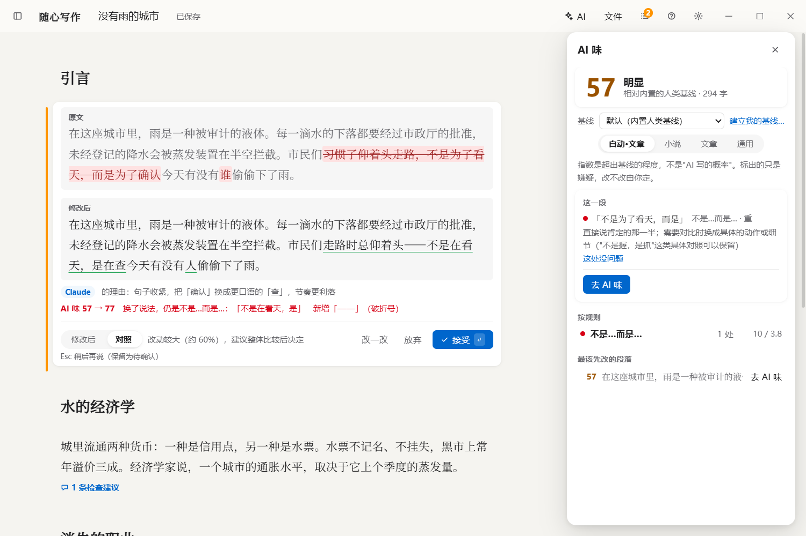
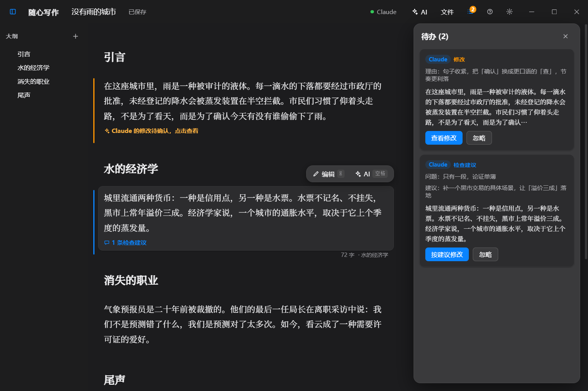
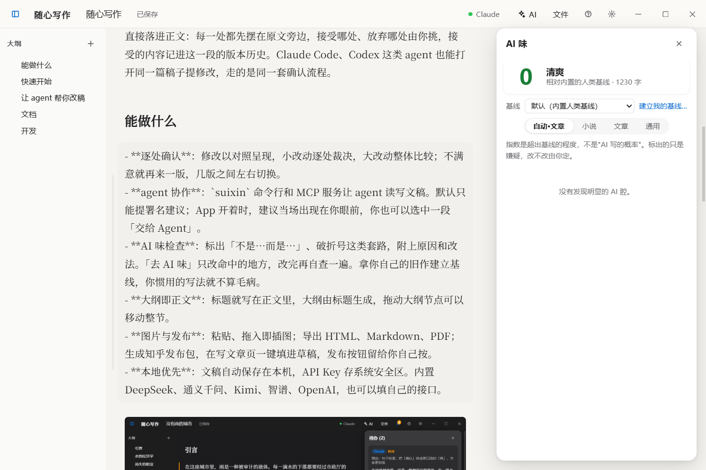

# 随心写作

**写作与改稿的桌面应用。AI 和 agent 只提修改建议，改不改，由你一处一处定。**

    



选中一段、一句或一节，让 AI 润色、精简、扩写或续写。改出来的东西不会直接落进正文：每一处都先摆在原文旁边，接受哪处、放弃哪处由你挑，接受的内容记进这一段的版本历史。Claude Code、Codex 这类 agent 也能打开同一篇稿子提修改，走的是同一套确认流程。

## 能做什么

- **逐处确认**：修改以对照呈现，小改动逐处裁决，大改动整体比较；不满意就再来一版，几版之间左右切换。
- **agent 协作**：`suixin` 命令行和 MCP 服务让 agent 读写文稿。默认只能提署名建议；App 开着时，建议当场出现在你眼前，你也可以选中一段「交给 Agent」。
- **AI 味检查**：标出「不是…而是…」、破折号这类套路，附上原因和改法。「去 AI 味」只改命中的地方，改完再自查一遍。拿你自己的旧作建立基线，你惯用的写法就不算毛病。
- **大纲即正文**：标题就写在正文里，大纲由标题生成，拖动大纲节点可以移动整节。
- **图片与发布**：粘贴、拖入即插图；导出 HTML、Markdown、PDF；生成知乎发布包，在写文章页一键填进草稿，发布按钮留给你自己按。
- **本地优先**：文稿自动保存在本机，API Key 存系统安全区。内置 DeepSeek、通义千问、Kimi、智谱、OpenAI，也可以填自己的接口。
- **Markdown 模式**：加粗、列表、引用直接显示效果，编辑时标记变淡；选中文字会浮出格式栏，也可以用 Ctrl+B、Ctrl+I。



## 快速开始

需要 Node.js 20 以上。桌面版另需 [Rust](https://www.rust-lang.org/tools/install)，Windows 上还要装 Visual Studio 的「使用 C++ 的桌面开发」组件。

```bash
npm install
npm run tauri dev     # 桌面版
npm run dev           # 只要浏览器版：http://localhost:5173
```

打包安装程序用 `npm run tauri build`。目前只在 Windows 11 上实机验证过，macOS 和 Linux 还没测。

## 让 agent 帮你改稿

```bash
npm run build:cli && npm link          # 得到命令 suixin
claude mcp add suixin -- suixin mcp    # Claude Code；Codex 用 codex mcp add suixin -- suixin mcp
```

装好之后，直接跟 agent 说「帮我看看随心写作里正开着的这篇」就行。命令行也可以自己用：

```bash
suixin status                                          # App 开着吗，你在看哪篇、选中了什么
suixin flavor @                                        # 这篇有多少 AI 味，套路都在哪
suixin replace @ --quote "原文" --text "改后" --why "理由"   # 提一条修改，等你确认
```

agent 想直接改正文、调整章节，得先在 App 里经你同意。完整用法见 `suixin guide`。

## 文档

- [使用说明](docs/使用说明.md)：快捷键、工程文件格式、命令行与实时协作的细节
- [AI 味方案](docs/AI味方案.md)：规则从哪来、分数怎么算、怎么改
- [产品规格](spec.md) · [界面设计](design.md) · [开发记录](docs/改进计划.md)

## 开发

Tauri 2（Rust）、React 18、TypeScript、Vite、Zustand。

```bash
npm run typecheck
npm test          # 单元测试（Vitest）
npm run e2e       # 端到端测试（Playwright；第一次先运行 npx playwright install chromium）
```

## 许可证

[MIT](LICENSE)

---

这份 README 是在随心写作里写的：Claude 通过实时通道把内容写进开着的 App，插截图、查 AI 味、导出 Markdown 都用的是 App 和 `suixin` 命令行。


